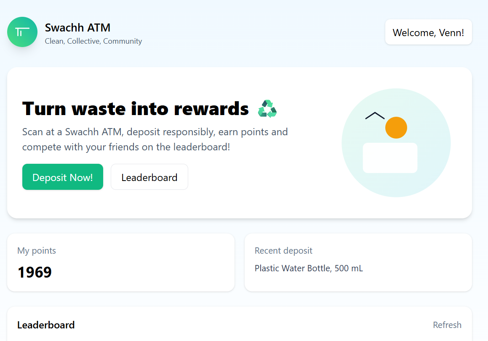

<h1 align="center">Swachh ATM</h1>

An automated and incentive-based waste collection and compression kiosk, for the community.

One of the most alarming issues our country faces everyday is waste management. Garbage covers not only the designated bins, but also overflows onto our roads and sidewalks, and fills our rivers and the ocean. The key issues are the lack of infrastructure, and the lack of public motivation to dispose of waste responsibly. Swachh ATM addresses this behavioral and infrastructural gap through an innovative, reward-based waste management system.

The Swachh ATM is an automated waste collection and compression kiosk that rewards users for depositing segregated dry and wet waste. Users insert their waste, which is identified and analyzed using computer vision, is compressed, and receive credits via their Swachh account. The ATM allows for the deposit and eased collection of both dry and wet waste in separated containers. The Swachh ATM is inspired by the German ‘Pfand’ system, where when certain qualifying containers are bought (water bottles, soda cans, glass beer bottles), a small deposit is added to the price, and the amount is credited back to the buyer in the form of redeemable vouchers if they return the bought items.

